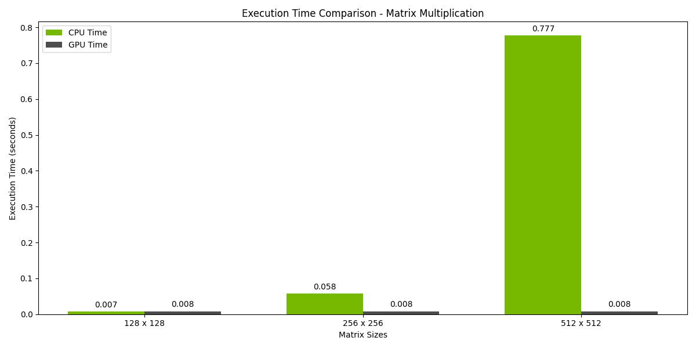

# CUDA Matrix Benchmark Project

This project benchmarks the performance of various matrix operations (Multiplication, Addition, and Inversion) on both CPU and GPU. It is designed to demonstrate the speedup achieved by parallel processing on GPUs using CUDA.



## Table of Contents

- [Project Overview](#project-overview)
- [Requirements](#requirements)
- [Setup Instructions](#setup-instructions)
- [Compiling and Running the Code](#compiling-and-running-the-code)
- [Automated Benchmarking](#automated-benchmarking)
- [Visualization](#visualization)
- [Results](#results)
- [License](#license)

## Project Overview

The project includes the following matrix operations:
- **Matrix Multiplication**: Multiplies two matrices.
- **Matrix Addition**: Adds two matrices element-wise.
- **Matrix Inversion**: Inverts a matrix using Gaussian elimination.

The benchmarking compares execution times between CPU and GPU for different matrix sizes.

## Requirements

- **CUDA Toolkit**: Make sure CUDA is installed on your system. For installation instructions, visit the [NVIDIA CUDA Toolkit Documentation](https://developer.nvidia.com/cuda-toolkit).
- **GCC**: Required for compiling C++ code.
- **Python 3**: Required for visualization. Install `matplotlib` and `numpy` using pip if not already installed:
```bash
pip install matplotlib numpy
```
- **Google Cloud Instance**: For running with an A100 GPU, ensure your instance is set up correctly with NVIDIA drivers.


## Setup Instructions

1. Clone the Repository:
```bash
git clone 
cd 
```

2. Ensure CUDA is correctly installed: Check if CUDA is installed by running:
```
nvcc --version
```

3. Compile the CUDA application: Compile the matrix_benchmark_app.cu using nvcc:
```bash
nvcc matrix_benchmark_app.cu -o matrix_benchmark_app
```

## Compiling and Running the Code

After compilation, you can manually run the program with the following command:

```bash
./matrix_benchmark_app
```

The program will prompt you to enter:

    Matrix size (e.g., 128, 256, 512).
    Operation choice:
    1 for Matrix Multiplication
    2 for Matrix Addition
    3 for Matrix Inversion
    The results will be saved in the timing_results.txt file.

## Automated Benchmarking

A shell script, run_benchmark.sh, is provided to automate the benchmarking process for multiple matrix sizes and operations.

Running the Automated Benchmark
1. Make the script executable:
```bash
chmod +x run_benchmark.sh
```

2. Run the script:
```bash
tim
```

The script will compile the code, run benchmarks for three matrix sizes (128, 256, 512) across all three operations, and log the results.

## Visualization

To visualize the performance results, a Python script generates bar plots comparing CPU and GPU execution times for each operation.

Running the Visualization Script
1. Ensure you have matplotlib and numpy installed:
```bash
pip install matplotlib numpy
```

2. Run the visualization script:
```bash
python plot_speedup.py
```

The script reads data from timing_results.txt and saves bar plots for each operation in the current directory.

## Results

The results of the benchmarks are saved in timing_results.txt, and the generated plots provide a visual representation of the speedup achieved by the GPU compared to the CPU.

Sample Output
The timing_results.txt file will look like this:
```markdown
Matrix Size: 128 x 128
Operation: Matrix Multiplication
CPU Time (seconds): 0.0052
GPU Time (seconds): 0.0018
Speedup (CPU/GPU): 2.89
------------------------
...
```

Sample Plots
- execution_time_comparison_Matrix_Addition.png
- execution_time_comparison_Matrix_Multiplication.png
- execution_time_comparison_Matrix_Inversion.png
These plots will compare the execution times of CPU and GPU for each operation.

## License

This project is licensed under the MIT License - see the LICENSE file for details.